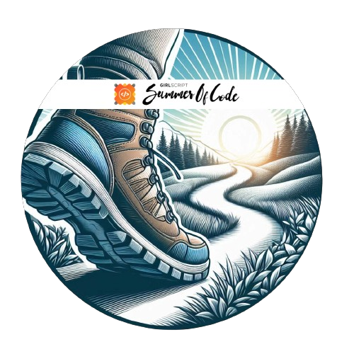
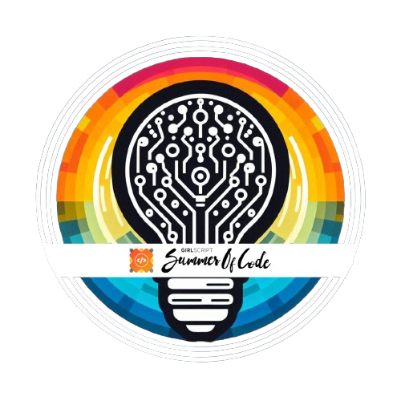
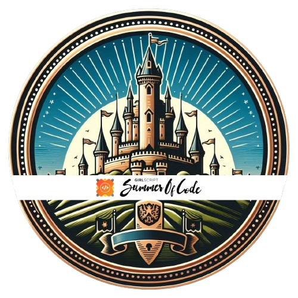
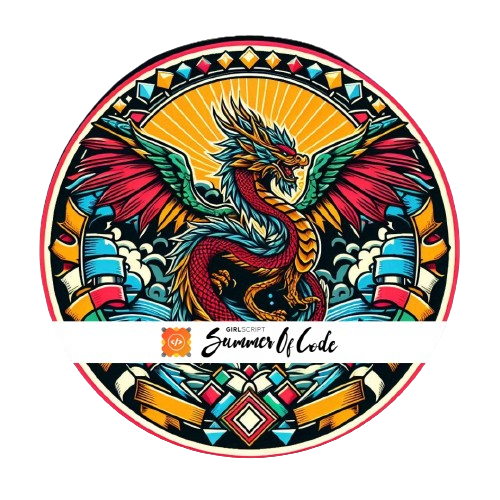

<h1 align="center">Hi 👋, I'm Rohit Yadav</h1>

  

---

## 💫 About Me

- 🔭 Full-Stack Web Developer | GenAI Developer | React Native Mobile Developer
- 💼 ~2 Year Internship Experience — Ex-Intern @YardStick, @Dislovalist Inc,  @Tayyari, @WellFounded It Sol.
- 🤝 Open to collaborations on Full-Stack & GenAI projects   
- 🎓 Final Year B.Tech Student  
- 👀 

---

## 🌐 Connect with Me

<!--  -->

<!-- 
## 📊 GitHub Stats

-->

<!-- 
## 🏅 GSSOC(24) Badges

  
  
  
  
  
  
  
  
  

-->

<!-- 
## 📌 Holopin Board

  

-->

<!-- 

<!--   
  

 -->
